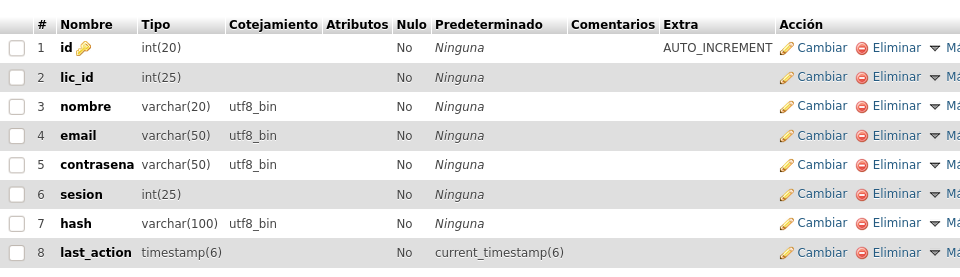
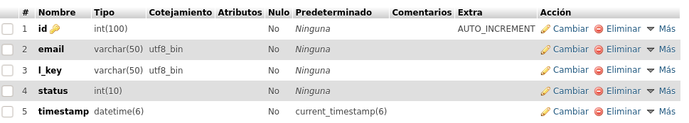

# halfegg 0.0.2
Login/logout

Este sistema de login / logout no tiene registro todavia

Sera necesario crear la base de datos y al menos un usuario en la tabla users siguiendo la estructura que se puede ver mas abajo. 

Las credenciales para conectar con la base de datos se encuentran en dos archivos:

### archivo config.php

 Nombre de base de  datos

define('NAMBDAT','/*NOMBRE DE TU BASE DE DATOS*/');

 Host de la base de datos
 
define('HOSBDAT','/*HOST(**localhost** en la mayoria de los casos)*/');

### archivo class-mod-db.php

linea 13 - usuario y contraseña de la base de datos

$dbh = new PDO($dsn, '/*USUARIO*/','/*CONTRASEÑA*/'); // user & pasword

## Estructura de Base de Datos
En esta version, se utilizan 2 tablas en la base de datos, es necesario crear las tablas manualmente

Tabla users:

Tabla licencias:

